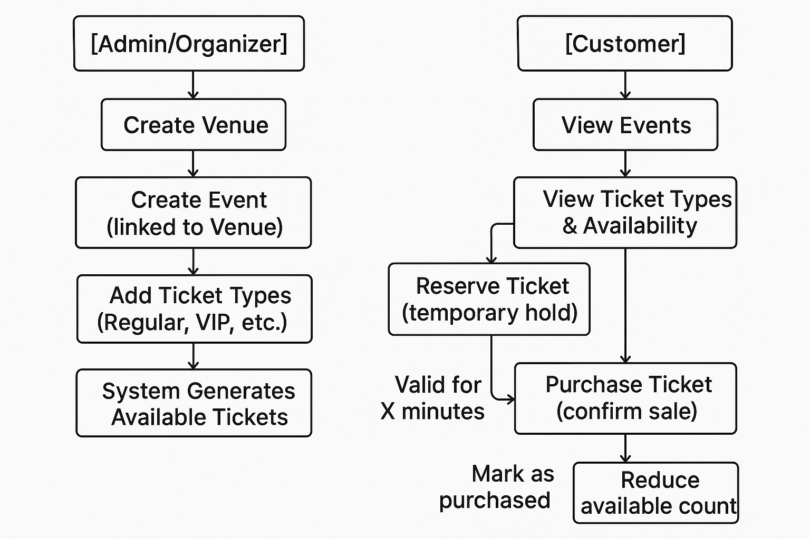

# 🎟️ Concert Ticket Management System – Flow Documentation

## 🛠️ Admin/Organizer Flow

1. **Create Venue**
   - Define venue details: name, location, capacity

2. **Create Event** (linked to Venue)
   - Set event metadata: title, date, time, description
   - Associate with an existing venue

3. **Add Ticket Types**
   - Define categories (e.g., Regular, VIP)
   - Set price and max allotment per type

4. **System Generates Tickets**
   - Automatically generate ticket inventory based on capacity and defined types

---

## 👤 Customer Flow

1. **View Events**
   - Browse all published upcoming events

2. **View Ticket Types & Availability**
   - Display ticket categories, prices, and current availability

3. **Reserve Ticket**
   - Temporarily hold selected ticket(s)
   - ⚠️ Valid for a fixed time window (e.g., 10 minutes)
4. **Cancel Reserved Ticket**
   
5. **Purchase Ticket**
   - Confirm and complete ticket purchase
     - Status updated to: `Purchased`
     - Remaining ticket count decreased

## System Flow Diagram

*(Concert Ticket Management System System Workflow.)*

---

## ⏱️ Reservation Logic

- Reserved tickets are held for a short period to prevent double-booking.
- If not purchased in time, reservation expires and tickets return to availability.

---

> **Note**: Payment and confirmation processes are assumed to be handled via a separate payment gateway integration.
